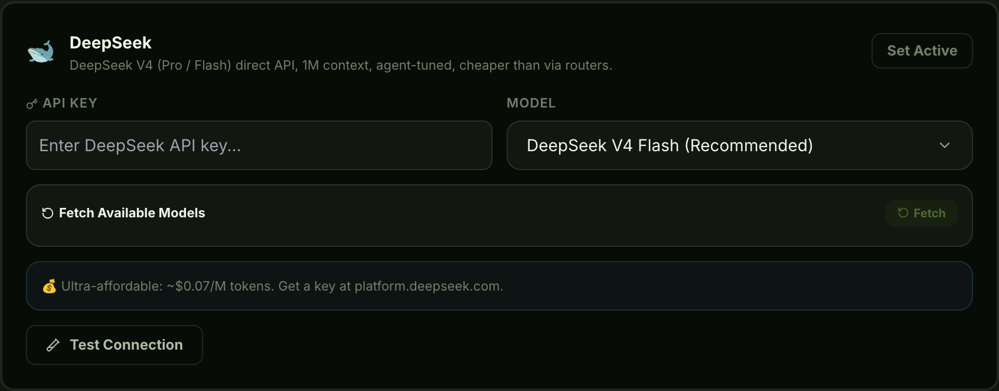

[English](./skales.md) | [简体中文](./skales.zh-CN.md) · [← 返回](../README.zh-CN.md)

# 在 Skales 中集成 DeepSeek

Skales 是一款本地优先的 AI 桌面智能体，支持 Windows、macOS 和 Linux，并提供 iOS 和 Android 配套应用。它像普通应用一样安装 —— 无需 Docker、无需终端、无需云账号 —— 为模型提供 197 个内置工具：文件、Shell、浏览器与电脑控制、日历与邮件、媒体工作室以及语音助手，界面支持 12 种语言。

- **GitHub:** <https://github.com/skalesapp/skales>
- **官网:** <https://skales.app>

#### 1. 安装 Skales

从 [skales.app](https://skales.app) 或 [GitHub Releases 页面](https://github.com/skalesapp/skales/releases/latest) 下载对应平台的安装包。

可用版本：

- Windows（`.exe`）
- macOS（`.dmg`，Intel 与 Apple Silicon）
- Linux（`.AppImage` / `.deb`）

#### 2. 配置 DeepSeek 提供商

DeepSeek 是 Skales 内置的一等提供商，并带有专属的调优配置。

1. 打开 **Settings → AI Providers**，找到 **DeepSeek** 卡片。
2. 将你的 [DeepSeek API Key](https://platform.deepseek.com/api_keys) 粘贴到 **API Key** 输入框。端点已预配置为 `https://api.deepseek.com`。
3. 选择模型：日常智能体任务选 **DeepSeek V4 Flash (Recommended)**，复杂多步任务选 **DeepSeek V4 Pro (Reasoning, 1M ctx)**。两者分别对应 `deepseek-v4-flash` 与 `deepseek-v4-pro`，并自动使用 1M token 上下文。
4. 点击 **Test Connection**，然后点击 **Set Active**。

#### 3. 推理强度

Skales 会将 `reasoning_effort` 转发给 DeepSeek V4。聊天输入框旁的 **Effort** 拨盘可按会话调节 —— 高难度任务请设为 **max** 并保持思考开启；Skales 从不关闭模型的推理能力。

#### 4. 更进一步

- **Goals** 在后台运行多步任务，完成后回报结果。
- **Code 窗口** 将会话绑定到项目文件夹：由 DeepSeek 驱动 diff、分支、提交与测试。
- **Studio · Flow** 将提示词变成演示文稿、文档、原型和动效片段，可导出为 PDF、PPTX、DOCX、SCORM 或 MP4。
- **Iris Orbit** 是语音界面：用说话代替打字，与同一个 DeepSeek 驱动的智能体对话。
